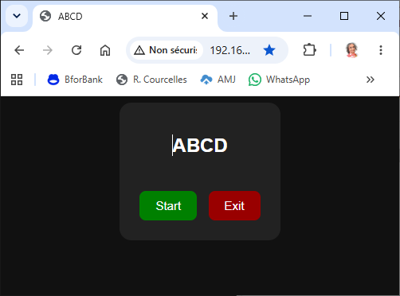
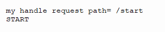

# Module 1 — Créer un serveur Web minimal avec MicroPython sur ESP32 (Thonny)
Ce module apprend à créer un serveur Web simple sur ESP32, capable de répondre à un navigateur avec une page HTML et de gérer des routes comme /led?state=on.
Tout est fait depuis Thonny, sans outils externes.

## Objectifs du module
À la fin de ce module, l’apprenant saura :

- connecter l’ESP32 au Wi‑Fi
- créer un serveur Web minimal basé sur une socket
- envoyer une page HTML au navigateur
- lire les requêtes HTTP entrantes

## Comprendre le principe d’un serveur Web sur ESP32
Un serveur Web repose sur quelques idées simples :

- un **réseau WLAN** au mode AP associé à un ``identifiant`` et un ``mot de passe``
- une **socket TCP** qui écoute en général sur le port 80

Par ailleurs, le serveur comporte aussi une section définissnt un **client**
qui sera transmis vers un navigateur Web (HTTP) grâce à cette **socket**. 

Ce client présente une **IHM** représentée sur le navigateur, et permettant l'**interactivité**:
- via l'interface clavier/souris avec l'**opérateur humain**
- et présente l'état des **données caractéristiques** du serveur sous forme graphique, numérique

Dans le cas qui nous intéresse, le serveur reçoit et agit sur des éléments hardware 
(**capteurs, actionneurs**). 

Nous verrons plus tard comment ces échanges se coordonnent en fonction des contraintes temporelles 
(les capteurs, les données en provenance d'autres parties du système, puis les actions de l'opérateur humain)

La gestion fonctionnelle du serveur repose sur des **requêtes**
- **émises** 
  - soit par l'opérateur humain (clavier, souris, ...), 
  - soit par les sources de données numériques internes ou externes (reseaux, capteurs, signaux) reçues par les différents canaux connectés au serveur. 
- **traitées** de façon algorithmique par le code du serveur.


## Structure Python utilisée pour construire le serveur/client

Comme les caractéristiques du serveur doivent rester cohérentes 
tout au long du fonctionnement du serveur, nous allons utiliser 
une structure **objet** et donc ce code sera installé dans une **classe** Python.

Les constituants principaux d'un serveur à installer dans cette classe sont:
- une **initialisation** chargée de créer les éléments de la structure
- les données de base:
    - le nom (ou le **titre**)
    - l'**identifiant** du réseau
    - le **mot de passe**
- les éléments HTTP du client Web (formant l'**IHM**) 
    - les éléments de style définissant l'apparence (**style**)
    - les constituants de l'IHM (**body**)
    - les éléments fonctionnels (en java script) (**script**)
-  les éléments fonctionnels du serveur:
    - la  boucle d'action principale (**run**)
    - le gestionnaire de réception des requêtes (**handler**)

Nous aurons besoin de librairies:
```
import network
import time
import socket
import gc
```

La classe Server:
```
class Server:
    # initialisation
    def __init__(self, 
                 title="ESP32-S3", 
                 ssid="ESP32",
                 password="123456789", 
                 style="", script="", body=""): ...

    def set_title(self, title): self.title = title
    def set_style(self, style=""): self.style = style
    def set_body(self, body=""): self.body = body
    def set_script(self, script=""): self.script = script
    # gestion des requêtes utilisateur
    def set_handler(self, func): self.http_handler = func
    
    # Envoi de la page HTML complète
    def send_html(self, conn, html):
        conn.send("HTTP/1.1 200 OK\r\nContent-Type: text/html\r\n\r\n")
        conn.send(html)

    # assemblage de la page IHM
    def html(self): ...
    # boucle principale 
    def run(self): ...
    # terminaison du serveur
    def stop_server(self): ...

```

### Initialisation

```
    def __init__(self, 
                 title="ESP32-S3", 
                 ssid="ESP32",
                 password="123456789", 
                 style="", script="", body=""):
        # -----  mémorisation des arguments 
        self.set_title(title)
        self.set_style(style)
        self.set_script(script)
        self.set_body(body)

        # ----- 1) ouverture d'un réseau au mode WiFi AP
        self.ap = network.WLAN(network.AP_IF)
        self.ap.active(True)
        self.ap.config(essid=ssid, password=password)

        while not self.ap.active():
            time.sleep(0.2)

        print("IP:", self.ap.ifconfig()[0])

        # ----- 2) création de la socket Socket serveur
        self.s = socket.socket()
        try:
            self.s.setsockopt(socket.SOL_SOCKET, socket.SO_REUSEADDR, 1)
        except:
            pass
        self.s.bind(("0.0.0.0", 80))
        self.s.listen(5)
        self.s.settimeout(0.1)  # très court pour rester réactif
        self.running = False
```

### Assemblage de l'IHM

L'IHM est construit sur une base simple, sur laquelle nous ajoutons les éléments fournis par l'implémentation spécifique pour:
- les objets HTML (**body**)
- le style pour l'apparence (**style**)
- les ajouts javascript (**script**)
- 
```
    def html(self):
        return f"""<!DOCTYPE html>
<html>
  <head>
    <meta charset="utf-8">
    <title>{self.title}</title>
    <style>
      body {{ background:#111; color:white; text-align:center; font-family:Arial; }}
      button {{ padding:10px 20px; margin:5px; font-size:15px; border:none; border-radius:8px; }}
      .exit {{ background:#900; color:white; }}
      .card {{ background:#222; padding:20px; border-radius:15px; display:inline-block; }}
      {self.style}
    </style>
  </head>
  <body> 
    <div class="card">
      <h2>{self.title}</h2>
      {self.body}
      <button class="exit" onclick="exitServer()">Exit</button>
    </div>
    <script>
      function exitServer() {{ fetch("/exit"); }}
      {self.script}
    </script>
  </body>
</html>
"""
```
### Boucle principale
La gestion consiste à accepter les requêtes reçues par la socket, puis les analyser 
sous forme de **routes** de la forme ``/<route>``

Ici, dans la fonctionnalité installé par défaut dans la classe de base 
fournit au moins la capacité de détecter la sensibilité d'un bouton **exit**

(*Ce bouton a été positionné par défaut en bas de l'IHM.*)

On détecte aussi la **route** minimale "/" qui produit simplement un rafraichissement de l'IHM.

Mais on a défini dans la classe de base la possiblilité de déclarer un gestionnaire de requête additionnel **http_handler**.
Ce gestionnaire additionnel sera chargé d'effectuer le parsing des requêtes et d'ajouter 
des comportements utilisateurs.

```
    def run(self):
        self.running = True
        while self.running:
            # Accept new connections
            try:
                conn, addr = self.s.accept()
            except:
                continue

            try:
                request = conn.recv(1024).decode()
                if not request:
                    conn.close()
                    continue

                method, path, _ = request.split(" ", 2)

                if path == "/exit":
                    self.running = False
                    self.stop_server()
                    break

                if self.http_handler:
                    handled = self.http_handler(self, path, conn)
                    if handled:
                        conn.close()
                        continue

                if path == "/":
                    self.send_html(conn, self.html())
                    conn.close()
                    continue

                conn.send("HTTP/1.1 404 Not Found\r\n\r\n")
                conn.close()

            except:
                try:
                    conn.close()
                except:
                    pass

        print("BYE")

```


### Utilisation de la classe **Server**

Nous allons développer une petite application utilisant la classe Server que nous venons d'expliciter.

## Utilisation de la classe Server

```
import server
import re
```

## Création et Initialisation du serveur

```
s = server.Server("ABCD")
```

## Nous allons simplement ajouter un bouton à l'IHM minimale

Un simple bouton avec un style propre, et une fonction associée:
```
s.set_style ("""
.start { background:green; color:white; }
""")

s.set_body ("""
<button class="start" onclick="runstart()">Start</button>
""")

s.set_script("""
function runstart() {
    fetch("/start");
}
""")

# --- Gestion des requêtes HTTP ---
def handle_request(s, path, conn):
    print("my handle request path=", path)
    if "/start" in path:
        print("START")
        # conn.send("HTTP/1.1 200 OK\r\n\r\n")
        conn.send(s.html())
        conn.close()
        
    return False

s.set_handler(handle_request)

```

## Lancement de l'application

```
s.run()
```






## Résumé du module
Vous savez maintenant :

- connecter l’ESP32 au Wi‑Fi
- créer un serveur Web minimal
- analyser une requête HTTP
- renvoyer une page HTML
- créer des routes simples
