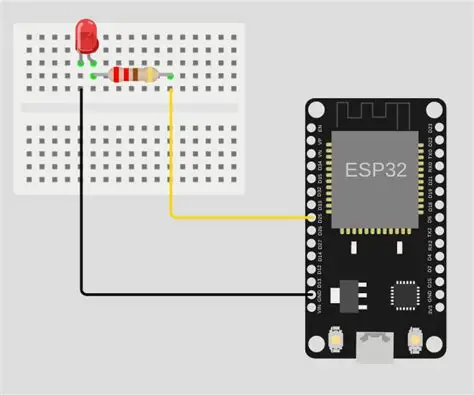
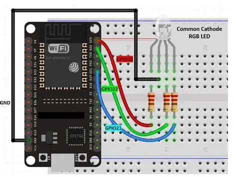
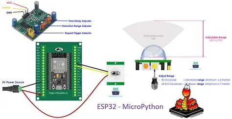
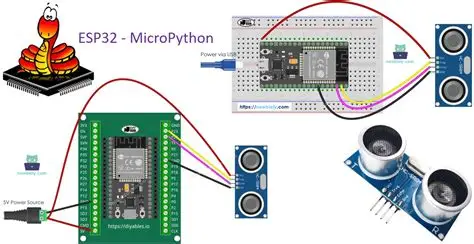

# Module 2: Comprendre ce qu’est une boucle événementielle et une coroutine.

- Savoir créer et lancer plusieurs tâches concurrentes.
- Manipuler ```uasyncio.sleep()``` pour éviter de bloquer le programme.
- Appliquer l’asynchrone à des cas concrets : LED, bouton, capteur.

## Pourquoi l’asynchrone sur ESP32 ?
L’ESP32 doit souvent :
- clignoter une LED,
- lire un capteur,
- gérer un bouton,
- servir une page web,
- communiquer en WiFi…

En fonctionnement **synchrone**, chaque tâche attend la précédente → 
le microcontrôleur devient lent ou non réactif.
En fonctionnement **asynchrone**, les tâches sont non bloquantes : 
elles avancent chacune à leur rythme tout en partageant le CPU.
C’est exactement ce que décrit la documentation MicroPython : 
l’asynchrone permet d’exécuter plusieurs tâches sans bloquer le programme .

## Le module uasyncio
MicroPython fournit une version légère d’asyncio :

```
import uasyncio as asyncio
```

Concepts clés :

- **coroutine** : fonction déclarée avec async def
- **await** : pause non bloquante
- **task** : coroutine lancée en parallèle
- **event loop** : moteur qui exécute les tâches

## Exemple 1 — Clignoter une LED sans bloquer
```
import uasyncio as asyncio
from machine import Pin

led = Pin(2, Pin.OUT)

async def blink():
    # On allume et éteint la LED indéfiniment
    while True:
        led.value(1)
        await asyncio.sleep(0.5)
        led.value(0)
        await asyncio.sleep(0.5)

async def main():
    # On lance la tâche de clignottement qui peut continuer
    # sans gêner le reste du programme
    asyncio.create_task(blink())
    await asyncio.sleep(10)   # laisse tourner 10s

asyncio.run(main())
```

- **await asyncio.sleep()** ne bloque pas le CPU.
- Pendant ce temps, d’autres tâches peuvent tourner.

## Exemple 2 — LED + lecture bouton en parallèle




```
import uasyncio as asyncio
from machine import Pin

led = Pin(2, Pin.OUT)
button = Pin(0, Pin.IN, Pin.PULL_UP)

async def blink():
    while True:
        led.value(not led.value())
        await asyncio.sleep(0.3)

async def watch_button():
    while True:
        if button.value() == 0:
            print("Bouton pressé !")
        await asyncio.sleep(0.05)

async def main():
    asyncio.create_task(blink())
    asyncio.create_task(watch_button())
    await asyncio.sleep(60)

asyncio.run(main())
```
- Plusieurs tâches tournent réellement en parallèle (coopératif).
- Le bouton est lu sans bloquer le clignotement.

## Exemple 3 — Lire un capteur périodiquement (ex. température)



```
import uasyncio as asyncio
from machine import ADC, Pin

adc = ADC(Pin(34))

async def read_sensor():
    while True:
        value = adc.read()
        print("Valeur :", value)
        await asyncio.sleep(1)

async def main():
    asyncio.create_task(read_sensor())
    await asyncio.sleep(30)

asyncio.run(main())
```

- Une tâche peut tourner à intervalle régulier.
- Le programme reste réactif.

## Exemple 4 — Serveur Web + LED (cas réel IoT)
Cet exemple illustre un cas typique décrit dans les tutoriels MicroPython : gérer un serveur web tout en restant réactif aux entrées/sorties .

```
import uasyncio as asyncio
from machine import Pin

led = Pin(2, Pin.OUT)

async def web_server(reader, writer):
    request = await reader.read(1024)
    led.value(not led.value())
    response = "HTTP/1.0 200 OK\r\n\r\nLED toggled!"
    await writer.awrite(response)
    await writer.aclose()

async def main():
    server = await asyncio.start_server(web_server, "0.0.0.0", 80)
    print("Serveur lancé")
    await server.wait_closed()

asyncio.run(main())
```

## Exercices pour les élèves
### Niveau 1
- Modifier la fréquence de clignotement.
- Ajouter une deuxième LED avec une fréquence différente.

### Niveau 2
- Faire un compteur qui s’incrémente toutes les secondes.
- Afficher le compteur sans bloquer le clignotement.

### Niveau 3
- Lire un capteur et envoyer les données via un serveur web.
- Ajouter un bouton qui active/désactive la lecture du capteur.

