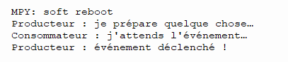
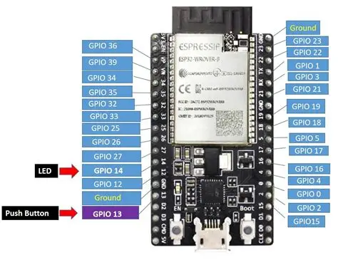
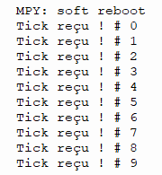

# Module 3: Les événements asynchrones en MicroPython (ESP32)

## Objectifs
- Comprendre ce qu’est un événement dans un système asynchrone.
- Utiliser ```asyncio.Event``` pour synchroniser des tâches.
- Déclencher des actions en réponse à un bouton, un timer ou une autre tâche.
- Construire un mini-système réactif basé sur des signaux internes.

## Qu’est‑ce qu’un événement asynchrone ?
Un événement est un signal envoyé par une tâche pour indiquer qu’une condition est remplie.
Dans MicroPython, on utilise :

- ```e = asyncio.Event()``` → création et initialisation d'un événement
- ```e.set()``` → déclenche l’événement
- ```e.clear()``` → réinitialise
- ```await e.wait()``` → attend que l’événement soit déclenché

C’est un mécanisme très utile pour coordination entre tâches.

## Exemple simple — Un événement déclenche une action
```
import uasyncio as asyncio

event = asyncio.Event()

async def producer():
    print("Producteur : je prépare quelque chose…")
    await asyncio.sleep(5)
    print("Producteur : événement déclenché !")
    event.set()

async def consumer():
    print("Consommateur : j'attends l'événement…")
    await event.wait()
    print("Consommateur : événement reçu !")

async def main():
    asyncio.create_task(consumer())
    await producer()

asyncio.run(main())
```

### Explications
- Le consommateur attend que l'événement arrive sans bloquer.
- Le producteur déclenche l’événement indépendemment
- Les deux tâches tournent en parallèle.



## Exemple — Bouton physique déclenchant un événement



```
import uasyncio as asyncio
from machine import Pin

button = Pin(0, Pin.IN, Pin.PULL_UP)
event = asyncio.Event()

async def watch_button():
    while True:
        if button.value() == 0:
            print("Bouton pressé → événement !")
            event.set()
        await asyncio.sleep(0.05)

async def react_to_event():
    while True:
        await event.wait()
        print("Réaction : LED ON pendant 1s")
        event.clear()
        await asyncio.sleep(1)

async def main():
    asyncio.create_task(watch_button())
    await react_to_event()

asyncio.run(main())
```

### Explications
- Le bouton ne bloque pas la boucle.
- L’événement sert de pont entre deux tâches.
- ```event.clear()``` permet de réarmer le système.

## Exemple — Timer logiciel déclenchant un événement périodique


```
import uasyncio as asyncio

tick = asyncio.Event()

async def timer():
    while True:
        await asyncio.sleep(1)
        tick.set()

async def task():
    i = 0
    while i < 10:
        await tick.wait()
        tick.clear()
        print("Tick reçu ! #", i)
        i += 1

async def main():
    asyncio.create_task(timer())
    await task()

asyncio.run(main())
```



### Explications
- Un événement peut remplacer un timer matériel.
- Très utile pour synchroniser plusieurs tâches.

## Exemple avancé — Pipeline d’événements (capteur → traitement → affichage)


```
import uasyncio as asyncio
from machine import ADC, Pin
import time

adc = ADC(Pin(34))
new_value = asyncio.Event()
buffer = dict()

t0 = time.time_ns()

async def read_sensor():
    global buffer
    while True:
        t = time.time_ns() - t0
        value = adc.read()
        buffer[t] = value
        new_value.set()
        await asyncio.sleep(0.2)

async def process_value():
    while True:
        # on attend l'arrivée d'une nouvelle valeur lue par l'ADC
        await new_value.wait()
        new_value.clear()
        print("Traitement :", buffer)

async def main():
    asyncio.create_task(read_sensor())
    await process_value()

asyncio.run(main())
```

### Explications
- Un événement peut transporter une notification, pas une donnée.
- La donnée est stockée ailleurs (ici dans buffer).
- On construit ici un pipeline asynchrone.

## Autres exercices possibles
### Niveau 1
- Créer un événement déclenché toutes les 500 ms.
- Faire réagir une LED.

### Niveau 2
- Bouton → événement → compteur qui s’incrémente.
- Afficher le compteur sans bloquer.

### Niveau 3
- Capteur → événement → filtrage → envoi WiFi.
- Ajouter un événement "stop" pour arrêter proprement.
